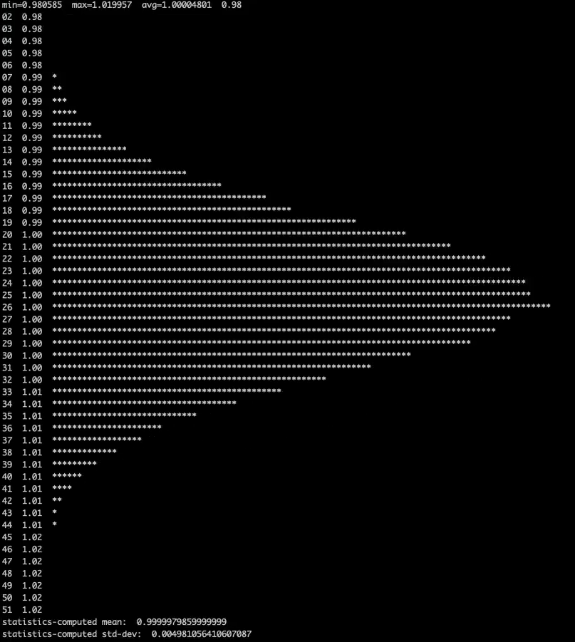

Miscellaneous packages for poisson and Box-Muller generators, and an incremental stats structure.

Example of running `./box` which plots a histogram of batches of random numbers having `mean=1 stddev=0.005`:

